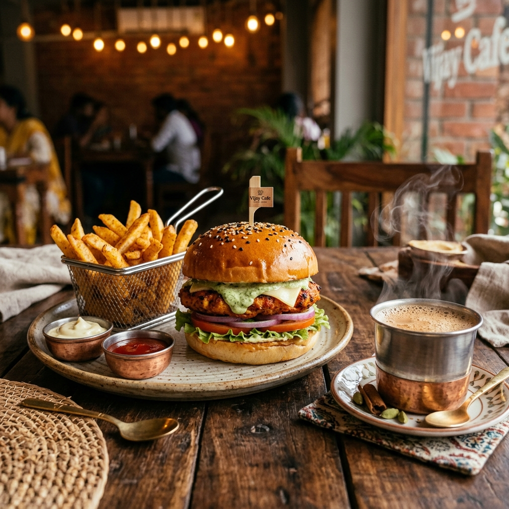
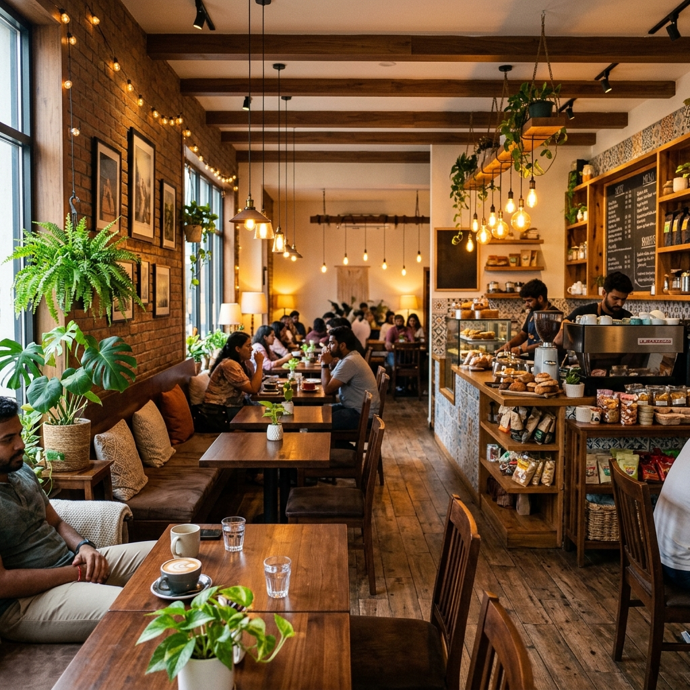
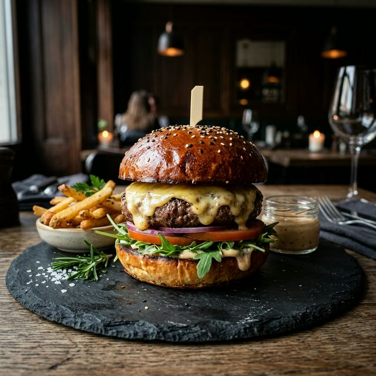

# ☕ Vijay Cafe | Fresh Bites. Great Vibes.

Experience delicious food, refreshing beverages, and the perfect cafe atmosphere. This project is a comprehensive, real-world cafe website with a modern landing page, dynamic menu, shopping cart, and a powerful admin dashboard.



## ✨ Key Features

### 🌐 Responsive Landing Page
- **Hero Section**: Premium visual design with animated blobs and call-to-action.
- **About Us**: The story of Vijay Cafe and our commitment to excellence.
- **Featured Flavors**: Quick links to our signature items like Artisan Coffee and Gourmet Burgers.
- **Customer Reviews**: Dynamic testimonial slider using Swiper.js.
- **Instagram Gallery**: Integrated social proof grid.
- **Interactive Map**: Location and contact details with Google Maps integration.

### 🍔 Dynamic Menu & Ordering
- **Real-time Menu**: Synchronized with Supabase for instant updates.
- **Search & Filter**: Search by name or description; filter by category and diet (Veg/Non-Veg).
- **Special Offers**: Managed dynamically via the admin panel.
- **Advanced Shopping Cart**:
  - Persistent storage (LocalStorage).
  - Real-time tax (CGST/SGST) and discount calculations.
  - Promo code support.

### 🔐 User Authentication
- Secure Login and Signup powered by Supabase.
- **Google Authentication** support for quick access.
- **Order History**: Personal dashboard for users to track their past orders.

### 📊 Powerful Admin Dashboard
- **Menu Management**: Add, edit, or remove menu items with ease.
- **Special Offers & Promos**: Control site-wide marketing campaigns.
- **Order Management**: Real-time receipt of new orders with audio notifications.
- **Sales Analytics**: Revenue trends, total orders, and top-selling items visualized with Chart.js.
- **POS Billing**: Integrated Point-of-Sale interface for staff to manage walk-in orders.
- **System Settings**: Control shop status (Online/Offline) and tax rates.

### 🌙 Premium UI/UX
- **Dark Mode**: Fully supported theme toggle.
- **Animations**: Silky smooth scroll animations using AOS (Animate on Scroll).
- **Responsive Design**: Optimized for mobile, tablet, and desktop.

## 🛠️ Technology Stack

- **Frontend**: HTML5, Vanilla CSS3, JavaScript (ES6+)
- **Backend/Database**: Supabase (PostgreSQL, Auth, Broadcast)
- **Library Integrations**:
  - [AOS](https://michalsnik.github.io/aos/) (Animations)
  - [Swiper](https://swiperjs.com/) (Sliders)
  - [Font Awesome](https://fontawesome.com/) (Icons)
  - [Chart.js](https://www.chartjs.org/) (Analytics)

## 🚀 Setup & Installation

1. **Clone the repository**:
   ```bash
   git clone https://github.com/yourusername/vijay-cafe.git
   ```
2. **Configure Supabase**:
   - Update `SUPABASE_URL` and `SUPABASE_KEY` in `script.js` and `admin.js` with your project credentials.
3. **Open the project**:
   - Simply open `index.html` in your favorite web browser or use a local live server.

## 📸 Project Assets

| Section | Preview |
|---:|:---|
| **About Us** |  |
| **Gourmet Burger** |  |
| **Artisan Coffee** |  |

---
*Designed with ❤️ by [VR Websites](https://vrwebsitesapplications.in/)*
